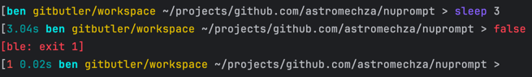

# nuprompt

My new bash prompt:

```
eval $(cargo run bash)

# Expands into PS0 and PROMPT_COMMAND. PS0 captures the previous command start time, while PROMPT_COMMAND generates a
# PS1 line with the exit code, duration, user, cwd, and git information.

PS0='$(nuprompt ps0 $$)'
PROMPT_COMMAND='eval $(nuprompt ps1 $$ $?)'
```



## Background

I'll be using the following bash things:

- `PROMPT_COMMAND` - a command to run before displaying the prompt via `PS1`. The output of this command goes to stdout just before displaying `PS1`.
- `PS1` - is the prompt variable to _render_ (not just print) on the left on a new prompt line. This can contain special variables and colour codes.
- `PS0` - an expression to evaluate just before executing the command captured by the prompt. Any output goes to stdout just before executing the command.

So what can I do with these to make it as easy to understand and install as possible?

Let's start with what I want to represent in my prompt:

1. The current working directory with $HOME replaced by ~
2. The git status if we're in a git directory
3. The exit code of the previous command (if not 0)
4. The current username or id
5. The execution time of the previous command

Firstly, lets assume that `PS1` is set by `PROMPT_COMMAND` in some way. Either, by having a bash function to capture the output, or by outputting some `eval`-able expression that sets it. So this can capture (3) and calculate (1), (2), and (4).

Then, we need to capture the time of the previous command. We can do this by using `PS0` to store the start time of a command in a temporary file associated with the shell process id. The bash special parameter `${$}` can be used to capture the PID and then write this to a temporary file. Then in our main prompt, we'll try to read this file and use the contents to calculate an elapsed time.

This leaves us with the form of `PROMPT_COMMAND='eval $(nuprompt ps1 ${$} ${?})` (with `${?}` capturing the previous exit code, and `${$}` capturing the shell process id). One thing I did in the previous version of my prompt was to insert a newline if the prompt wasn't at the left hand margin. This could happen if the previous command output _didn't_ have a newline itself, however, after using this for some time I found that it wasn't clever enough and would frequently break commands if I typed them too fast.

## FAQ

### Why write a binary? why not use the `PS1` formatting characters and pure bash?

Because I want to.
